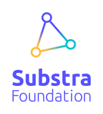

[](https://travis-ci.org/SubstraFoundation/distributed-learning-contributivity)
[](https://colab.research.google.com/github/SubstraFoundation/distributed-learning-contributivity/blob/master/run_experiment_on_google_collab.ipynb)
[](https://substra.us18.list-manage.com/track/click?e=2effed55c9&id=fa49875322&u=385fa3f9736ea94a1fcca969f)

# Simulate collaborative multi-partner ML projects & Experiment learning and contributivity measurement approaches

- [Introduction](#introduction)
  * [Context of this work](#context-of-this-work)
  * [How to interact with this?](#how-to-interact-with-this)
- [About this repository](#about-this-repository)
  * [Experimental approach](#experimental-approach)
  * [Structure of the library](#structure-of-the-library)
    + [Scenarios](#scenarios)
    + [Multi-partner learning approaches](#multi-partner-learning-approaches)
    + [Contributivity measurement approaches](#contributivity-measurement-approaches)
  * [Run an experiment](#run-an-experiment)
    + [Using the code files](#using-the-code-files)
    + [Using the library](#using-the-library)
  * [Ongoing work and improvement plan](#ongoing-work-and-improvement-plan)
- [Contacts, contributions, collaborations](#contacts,-contributions,-collaborations)
___

## Introduction

In collaborative data science projects partners sometimes need to train a model on multiple datasets, contributed by different data providing partners. In such cases the partners might have to measure how much each dataset involved contributed to the performance of the model. This is useful for example as a basis to agree on how to share the reward of the ML challenge or the future revenues derived from the predictive model, or to detect possible corrupted datasets or partners not playing by the rules. We explore this question and the opportunity to implement some mechanisms helping partners in such scenarios to measure each dataset's *contributivity* (as *contribution to the performance of the model*).

### Context of this work

This work is being carried out in the context of collaborative research projects. It is work in progress. We would like to share it with various interested parties, research and business partners to get their feedback and potential contributions. This is why it is shared as open source content on Substra Foundation’s repositories.

### How to interact with this?

It depends in what capacity you are interested! For example:

- If you'd like to experiment right now by yourself multi-partner learning approaches and contributivity measurement methods, jump to section **[Run an experiment.](#run-an-experiment)**
- If you'd like to get in touch with the workgroup, jump to section **[Contacts, contributions, collaborations](#contacts-contributions-collaborations)**. If you are a student or a teacher, we love discussing student projects!
- If you are very familiar with this type of projects, well you can either have a look at section **[Ongoing work and improvement plan](#ongoing-work-and-improvement-plan)** or head towards [issues](https://github.com/SubstraFoundation/distributed-learning-contributivity/issues) and [PRs](https://github.com/SubstraFoundation/distributed-learning-contributivity/pulls) to see what's going on these days. We use the `help wanted` tag to flag issues on which help is particularly wanted, but other open issues would also very much welcome contributions

Should you have any question, [reach out](#contacts-contributions-collaborations) and we'll be happy to discuss how we could help.

## About this repository

In this repository, we benchmark different contributivity measurement approaches on a public dataset artificially partitioned in a number of individual datasets, to mock a collaborative ML project.

The objective is to compare the contributivity figures obtained with the different approaches, and try to see how potential differences could be interpreted.

The public datasets currently supported are: MNIST, CIFAR10, TITANIC, ESC50 and IMDB.


### Structure of the library

This library can be broken down into 3 blocks:

1. Scenarios
1. Multi-partner learning approaches
1. Contributivity measurement approaches

#### Scenarios

From the start of this work it seemed very useful to be able to simulate different multi-partner settings to be able to experiment on them. For that, the library enables to configure scenarios by specifying the number of partners, what are the relative volume of data they have, how the data are distributed among them, etc. (see our [first Tutorial](https://github.com/SubstraFoundation/distributed-learning-contributivity/blob/master/notebooks/tutorials/Tutorial-1_Run_your_first_scenario.ipynb), and the related documentation's section [Definition of collaborative scenarios](./mplc/docs/documentation.md#definition-of-collaborative-scenarios) for all available parameters).

#### Multi-partner learning approaches

Once a given scenario configured, it seemed useful to choose how the multi-partner learning would be done. So far, 3 different approaches are implemented (federated averaging, sequential learning, sequential averaging). See related documentation's section [Configuration of the collaborative and distributed learning](./mplc/docs/documentation.md#configuration-of-the-collaborative-and-distributed-learning) for descriptive schemas and additional ML-related parameters.

#### Contributivity measurement approaches

Finally, with given scenarios and multi-partner learning approaches, we can address contributivity measurement approaches. See documentation's sections [Configuration of contributivity measurement methods to be tested](./mplc/docs/documentation.md#scenario-parameters) and [Contributivity measurement approaches studied and implemented](./mplc/docs/documentation.md#configuration-of-contributivity-measurement-methods-to-be-tested).

### Installation 

##### Using pip

```bash
$ pip install mplc
```

This installs the last packaged version on pypi. If the installation fails on your platform, please open an issue to let us know.

##### Build from Source 

If you want to install mplc from the repository, make sure that you got the latest version of pip. 

Then clone the repository, and trigger the installation using pip.

```bash
$ git clone https://github.com/SubstraFoundation/distributed-learning-contributivity.git
$ cd distributed-learning-contributivity
$ pip install -e . 
```

### Run an experiment

There are two ways to run an experiment. You can first use the mplc library in a notebook, or regular python script, as it is demonstrated in the [tutorials](./notebooks/tutorials).

For instance : 

#### Using this library 

```python
from subtest.scenario import Scenario
my_scenario = Scenario(partners_count=3,
                       amounts_per_partner=[0.2, 0.3, 0.5],
                       dataset_name='mnist',
                       epoch_count=10,
                       minibatch_count=3)
my_scenario.run()
# (...) Results' exploration 
```

You can also use the main.py provided in the repository, with a yaml config file.
#### Using the main.py script

1. Define your mock scenario(s) in the `config.yml` file by changing the values of the suggested parameters of the 2 example scenarios (you can browse more available parameters in section [Config file parameters](#config-file-parameters) below). For example:

    ```yaml
    experiment_name: my_custom_experiment
    n_repeats: 5
    scenario_params_list:
     - dataset_name:
       'mnist':
        - 'random_initialization'
       'cifar10':
        - 'random_initialization'
       partners_count: 
         - 3
       amounts_per_partner:
         - [0.4, 0.3, 0.3]
       samples_split_option:
         - ['advanced', [[7, 'shared'], [6, 'shared'], [2, 'specific']]]
       multi_partner_learning_approach:
         - 'fedavg'
       aggregation_weighting:
         - 'data_volume'
         - 'uniform'
       epoch_count:
         - 38
       methods:
         - ["Shapley values", "Independent scores", "TMCS"]
       minibatch_count:
         - 20
       gradient_updates_per_pass_count:
         - 8
       dataset_proportion:
	     - 1
     - dataset_name:
         - 'mnist'
       partners_count:
         - 2
       amounts_per_partner:
         - [0.5, 0.5]
       samples_split_option:
         - ['basic', 'random']
         - ['basic', 'stratified']
       multi_partner_learning_approach:
         - 'fedavg'
       aggregation_weighting:
         - 'data_volume'
         - 'uniform'
       epoch_count:
         - 38
       methods:
         - ["Shapley values", "SMCS", "IS_lin_S", "IS_reg_S"]
       minibatch_count:
         - 20
       gradient_updates_per_pass_count:
         - 8
       dataset_proportion:
	     - 1
    ```

   Under `scenario_params_list`, enter a list of sets of scenario(s). Each set starts with ` - dataset_name:` and must have only one `partners_count` value. The length of `amount_per_partners`, `corrupted_datasets` (and `samples_split_option` when the advanced definition is used) must match the `partner_counts` value. If for a given parameter multiple values are specified, e.g. like for `agregation_weighting` in the first scenario set of the above example, all possible combinations of parameters will be assembled as separate scenarios and run.

2. Then execute `main.py -f config.yml`. Add the `-v` argument if you want a more verbose output.

3. A `results.csv` file will be generated in a new folder for your experiment under `/experiments/<your_experiment>`. You can read this raw `results.csv` file or use the notebooks in `/notebooks`.  

   **Note**: example experiment(s) are stored in folder `/saved_experiments` to illustrate the use of the library. The notebooks include graphs, like for example the following:  
   
   

 
### Ongoing work and improvement plan

The current work focuses on the following 4 priorities:

1. Improve the **[multi-partner learning approaches](https://github.com/SubstraFoundation/distributed-learning-contributivity/projects/4)**
1. Continue developing new **[contributivity measurement methods](https://github.com/SubstraFoundation/distributed-learning-contributivity/projects/3)**
1. Perform **[experiments](https://github.com/SubstraFoundation/distributed-learning-contributivity/projects/1)** and gain experience about best-suited multi-partner learning approaches and contributivity measurement methods in different situations
1. Make the library **[agnostic/compatible with other datasets and model architectures](https://github.com/SubstraFoundation/distributed-learning-contributivity/projects/2)**

There is also a transverse, continuous improvement effort on **[code quality, readability, optimization](https://github.com/SubstraFoundation/distributed-learning-contributivity/projects/5)**.

This work is collaborative, enthusiasts are welcome to comment open issues and PRs or open new ones.

## Contacts, contributions, collaborations

Should you be interested in this open effort and would like to share any question, suggestion or input, you can use the following channels:

- This Github repository (issues or PRs)
- Substra Foundation's [Slack workspace](https://substra-workspace.slack.com/join/shared_invite/zt-cpyedcab-FHYgpy08efKJ2FCadE2yCA), channel `#workgroup-mpl-contributivity`
- Email: hello@substra.org
- Come meet with us at La Paillasse (Paris, France), Le Palace (Nantes, France) or Studio Iconosquare (Limoges, France)

 
