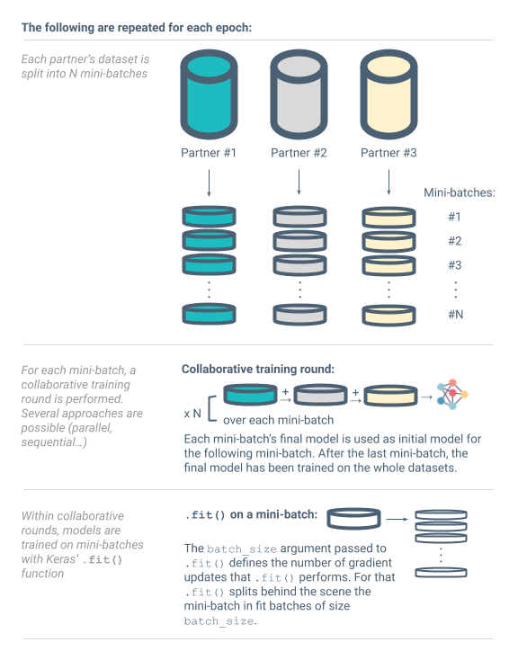

[](https://travis-ci.org/SubstraFoundation/distributed-learning-contributivity)

# Exploration of dataset contributivity to a model in collaborative ML projects

## Introduction

In collaborative data science projects partners sometimes need to train a model on multiple datasets, contributed by different data providing partners. In such cases the partners might have to measure how much each dataset involved contributed to the performance of the model. This is useful for example as a basis to agree on how to share the reward of the ML challenge or the future revenues derived from the predictive model, or to detect possible corrupted datasets or partners not playing by the rules. We explore this question and the opportunity to implement some mechanisms helping partners in such scenarios to measure each dataset's *contributivity* (as *contribution to the performance of the model*).

## Context of this work

This work is being carried out in the context of collaborative research projects. It is work in progress. We would like to share it with various interested parties, research and business partners to get their feedback and potential contributions. This is why it is shared as open source content on Substra Foundation’s repositories.

## About this repository

In this repository, we benchmark different contributivity measurement approaches on a public dataset artificially split in a number of individual datasets, to mock a collaborative ML project.

The objective is to compare the contributivity figures obtained with the different approaches, and try to see how potential differences could be interpreted.

### Experimental approach

We want to start experimenting contributivity evaluations in collaborative data science and distributed learning scenarios. Our exploration of this topic is in progress, as is this library and associated experiments. To make the most out of it, it is key to capitalize on this effort and develop it as a reproducible pipeline that can be improved, enriched, complemented over time.

For a start we made the following choices:

- What we want to compare (with the Shapley values being the baseline, see section below):
  - Contributivity relative values
  - Computation time
- Public dataset for experiments: MNIST
- ML algorithm: CNN adapted to MNIST, not too deep so it can run on CPU
- Distributed learning approach: federated learning (variants of basic federated learning are being implemented too)

### Contributivity measurement approaches studied and implemented

- [done] **Performance scores** of models trained independently on each partner

- [done] [**Shapley values**](https://arxiv.org/pdf/1902.10275.pdf):  

  These indicators seem to be very good candidates to measure the contributivity of each data providers, because they are usually used in game theory to fairly attributes the gain of a coalition game amongst its players, which is exactly want we are looking for here.
  
  A coalition game is a game where players form coalitions and each coalitions gets a score according to some rules. The winners are the players who manage to be in the coalition with the best score. Here we can consider each data provider is a player, and that forming a coalition is building a federated model using the dataset of each player within the coalition. The score of a coalition is then the performance on a test set of the federated model built by the coalition.

  To attributes a part of the global score to each player/data providers, we can use the Shapley values. To define the Shapley value we first have to define the "increment" in performance of a player in a coalition. Such "increment" is the performance of the coalition minus the performance of the coalition without this player. The Shapley value of a player is a properly weighted average of its "increments" in every possible coalition.
  
  The computation of the Shapley Values quickly becomes intensive when the number of players increases. Indeed to compute the increment of a coalition, we need to fit two federated model, and we need to do this for every possible coalitions. If *N* is the number of players we have to do *2^N* fits to compute the Shapley values of each players. As this is quickly too costly, we are considering estimating the Shapley values rather then computing it exactly. The estimation methods considered are:

  - [done] **The exact Shapley Values computation**:  
  Given the limited number of data partners we consider at that stage it is possible to actually compute the Shapley Values with a reasonable amount of resources.
    
  - [done] **[Monte-Carlo Shapley](https://arxiv.org/pdf/1902.10275.pdf) approximation** (also called permutation sampling):  
  As the Shapley value is an average we can estimate it using the Monte-Carlo method. Here it consists in sampling a reasonable number of increments (says a hundred per player) and to take the average of the sampled increments of a player as the estimation of the Shapley value of that player.
    
  - [done] **[Truncated Monte-Carlo Shapley](https://arxiv.org/pdf/1904.02868.pdf) approximation**:  
  The idea of Truncated Monte-Carlo is that, for big coalition, the increments of a player are usually small, therefore we can consider their value is null instead of spending computational power to compute it. This reduce the number of times we have to fit a model, but adds a small bias the estimation.
    
  - [done] **Interpolated truncated Monte-Carlo**:  
  This method is an attempt to reduce the bias of the Truncated monte-Carlo method. Here we do not consider the value of an increment of a big coalition is null, but we do a linear interpolation to better approximate its value.
    
- [done] **Importance sampling methods**:

  Importance sampling is a method to reduce the number of sampled increments in the Monte-Carlo method while keeping the same accuracy. It consists in sampling the increments according to non-uniform distribution, giving more chance for big increment than for small increment to be sampled. The bias induced by altering the sampling distribution is canceled by properly weighting each sample: If an increment is sampled with *X* times more chances, then we weight it by *1/X*. Note that this require to know the value of increment before computing them, so in practice we try to guess the value of the increment. We inflate, resp. deflate, the probability of sampling an increment if we guess its value is big, resp. small. We designed three ways to guess the value of increments, which lead to three different importance sampling methods:
  
  - [done] **Linear importance sampling**
  - [done] **Regression importance sampling**
  - [done] **Adaptative kriging importance sampling**

- [done] **[Stratified Monte Carlo Shapley](https://arxiv.org/pdf/1904.02868.pdf)**:

  "Stratification and with proper allocation" is another method to reduce the number of sampled increments in the Monte-Carlo method while keeping the same accuracy. There are two ideas behind this method:

  1. The Shapley value is a mean of means taken on strata of increments. A strata of increments corresponds the all the increments of coalition with the same number of players. We can estimate the means on each strata independently rather than the whole mean, this improves the accuracy and reduces the number of increments to sample.
  1. We can allocate a different amount of sampled increment to each mean of a strata. If we allocate more sample to the stratas where the increments value varies more, we can reduce the accuracy even more.
   
  As we can estimate the mean of a strata by sampling with replacement of without replacement, it gives two approximation methods:
  
  - [done] **Stratified Monte Carlo Shapley with replacement**
  - [done] **Stratified Monte Carlo Shapley without replacement**
    
- [future prospect] [**Data Valuation by Reinforcement Learning**](https://arxiv.org/pdf/1909.11671.pdf) (DVRL):

  With DVRL, we modify the learning process of the main model so it includes a data valuation part. Namely we use a small neural network to assign weight to each data, and at each learning step these weights are used to sample the learning batch. These weight are updated at each learning iteration of the main model using the REINFORCE method.
  
### Using the code files

- Define your mock scenario(s) in `config.yml` by changing the values of the suggested parameters of the 2 example scenarios (you can browse more available parameters in section [Config file parameters](#config-file-parameters) below). For example:

    ```yaml
    experiment_name: my_custom_experiment
    n_repeats: 5
    scenario_params_list:
         - partners_count: 
              - 3
           amounts_per_partner: 
              - [0.4, 0.3, 0.3] 
           samples_split_option: 
             - [[7, 'shared'], [6, 'shared'], [2, 'specific']]
           aggregation_weighting: 
             - 'data_volume' 
             - 'uniform'
           epoch_count: 
             - 38
           methods:
             - ["Shapley values", "Independent scores", "TMCS"]
           minibatch_count: 
             - 20
           fit_batches_count:
             - 8
         - partners_count: 
             - 2
           amounts_per_partner: 
             - [0.5, 0.5]
           samples_split_option: 
             - 'random'
             - 'stratified'
           aggregation_weighting: 
             - 'data_volume' 
             - 'uniform'
           epoch_count: 
             - 38
           methods:
             - ["Shapley values", "Independent scores", "TMCS"]
           minibatch_count: 
             - 20
           fit_batches_count:
             - 8
    ```

- Under `scenario_params_list`, enter a list of sets of scenario(s). Each set must have only one `partners_count` value. The length of `amout_per_partners`, `corrupted_datasets` (and `samples_split_option` when the advanced definition is used) must match the `partner_counts`. If for a given parameter multiple values are specified, e.g. like for `samples_split_option` and `agregation_weighting` in the example above, all possible combinations of parameters will be assembled as separate scenarios and run.
- Then execute `main.py -f config.yml`
- A `results.csv` file will be generated in a new folder for your experiment under `/experiments/<your_experiment>`. You can read this raw `results.csv` file or use the `analyse_results.ipynb` generated notebook to quickly generate figures.

### Config file parameters

#### Experiment-level parameters

An experiment regroups one or several scenarios to be run.

`experiment_name`: `str`  
How the experiment will be named in output files.  
Example: `experiment_name: my_first_experiment`
  
`n_repeats`: `int`  
How many times the experiment is run.  
Example: `n_repeats: 2`

#### Scenario-level parameters

##### Definition of collaborative scenarios

`partners_count`: `int`  
Number of partners in the mocked collaborative ML scenario.  
Example: `partners_count: 4`

`amounts_per_partner`: `[float]`  
Fractions of the original dataset each partner receives to mock a collaborative ML scenario where each partner provides data for the ML training.  
Example: `amounts_per_partner: [0.3, 0.3, 0.1, 0.3]`

`samples_split_option`: `'random'` (default), `'stratified'` or `[[nb of clusters (int), 'shared' or 'specific']]`   
How the original dataset data samples are split among partners:

- `'random'`: the dataset is shuffled and partners receive data samples selected randomly
- `'stratified'`: the dataset is stratified per class and each partner receives certain classes only
- `[[nb of clusters (int), 'shared' or 'specific']]`: in certain cases it might be interesting to split the dataset among partners in a more elaborate way. For that we consider the data samples from the initial dataset as split in clusters per data labels. The advanced split is configured by indicating, for each partner in sequence, the following 2 elements:
  - `nb of clusters (int)`: the given partner will receive data samples covering this number of different clusters (clusters of data samples per labels/classes) 
  - `'shared'` or `'specific'`:
    - `'shared'`: all partners with option `'shared'` receive data samples picked from clusters they share data samples from
    - `'specific'`: each partner with option `'specific'` receives data samples picked from cluster(s) it is the only one to receive from

Example: `[[7, 'shared'], [6, 'shared'], [2, 'specific'], [1, 'specific']]`

`corrupted_datasets`: `[not_corrupted (default), shuffled or corrupted]`  
Enables to artificially corrupt the data of one or several partners:

- `not_corrupted`: data are not corrupted
- `shuffled`: labels are shuffled randomly, not corresponding anymore with inputs
- `corrupted`: labels are all offseted of `1` class
  
Example: `[not_corrupted, not_corrupted, not_corrupted, shuffled]`

##### Configuration of the collaborative and distributed learning 

There are several parameters influencing how the collaborative and distributed learning is done over the datasets of the partners. The following schema introduces certain definitions used in the below description of parameters:



`aggregation_weighting`: `'uniform'` (default), `'data_volume'` or `'local_score'`  
After a training iteration over a given mini-batch, how individual models of each partner are aggregated:

- `'uniform'`: simple average (non-weighted)
- `'data_volume'`: average weighted with per the amounts of data of partners (number of data samples)
- `'local_score'`: average weighted with the performance (on a central validation set) of the individual models
 
`single_partner_test_mode`: `'global'` (default) or `'local'`  
When training a model on a single partner (this is needed in certain contributivity measurement approaches), defines if the final performance is tested on the central testset or on the partner's local testset. Note: a train-test split is performed on the original dataset, forming a central testset; this testset is also split over each partner (randomly) forming local testsets.  

`epoch_count`: `int` (default: `40`)  
Number of epochs passed as argument in the `.fit()` function. Superseded when `is_early_stopping` is set to `true`.  
Example: `epoch_count: 30`

`minibatch_count`: `int` (default: `20`)  
The distributed learning approach implemented relies on a sequence of (i) training in parallel on each partner's dataset, and then (ii) aggregating the resulting models. This constitutes an individual iteration. These iterations are repeated for all *mini-batches* into which the partner's datasets are split at the beginning of each epoch. This gives a total of `epoch_count * minibatch_count` iterations.  
Example: `minibatch_count: 20`

`fit_batches_count`: `int` (default: `8`)  
The ML training implemented relies on Keras' `.fit()` function, which takes as argument a `batch_size`, used as the number of samples per gradient update. Depending on the number of samples in the train dataset, this defines how many gradient updates are done per iteration over the dataset passed as argument to `.fit()`. The `fit_batches_count` parameter enables to specify this number of gradient updates per iteration over the dataset passed as argument to `.fit()` (both for multi-partner setting where there is one `.fit()` iteration per mini-batch with a single epoch, and for single-partner setting where there is one `.fit()` iteration with multiple epochs).  
Example: `fit_batches_count: 5`

`is_early_stopping`: `True` (default) or `False`  
When set to `True`, the training phases (whether multi-partner of single-partner) are stopped when the performance on the validation set reaches a plateau.

**Note:** to only launch the distributed learning on the scenarios (and no contributivity measurement methods), omit the `methods` parameter (see section [Configuration of contributivity measurement methods to be tested](#configuration-of-contributivity-measurement-methods-to-be-tested) below).

##### Configuration of contributivity measurement methods to be tested

`methods`:  
A declarative list of the contributivity measurement methods to be executed.
All methods available are:
```yaml
methods:
    - "Shapley values"
    - "Independent scores"
    - "TMCS"
    - "ITMCS"
    - "IS_lin_S"
    - "IS_reg_S"
    - "AIS_Kriging_S"
    - "SMCS"
    - "WR_SMC"
```
See above section [Contributivity measurement approaches studied and implemented](#contributivity-measurement-approaches-studied-and-implemented) for explanation of the different methods.  
**Note:** When `methods` is omitted in the config file only the distributed learning is run.

##### Miscellaneous

`is_quick_demo`: `True` or `False` (default)  
When set to `True`, the amount of data samples and the number of epochs and mini-batches are significantly reduced, to minimize the duration of the run.

## Contacts

Should you be interested in this open effort and would like to share any question, suggestion or input, you can use the following channels:
  - This Github repository (issues or PRs)
  - Substra Foundation's [Slack workspace](https://substra-workspace.slack.com/join/shared_invite/zt-cpyedcab-FHYgpy08efKJ2FCadE2yCA)
  - Email: hello@substra.org
  - Come meet with us at La Paillasse (Paris, France), Le Palace (Nantes, France) or Studio Iconosquare (Limoges, France)
