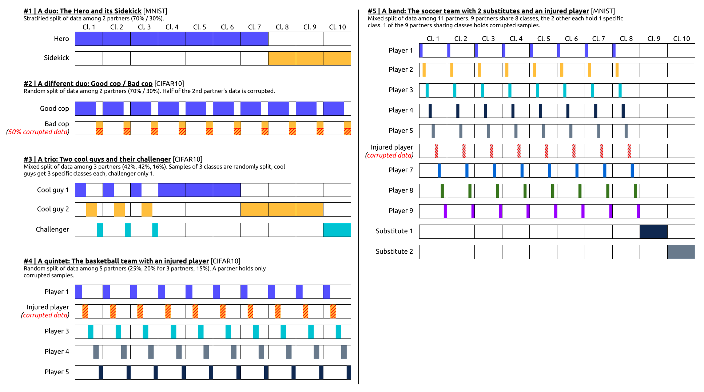

[](https://github.com/LabeliaLabs/distributed-learning-contributivity/actions?query=branch%3Amaster)
[](https://codecov.io/gh/LabeliaLabs/distributed-learning-contributivity)
[](https://colab.research.google.com/github/LabeliaLabs/distributed-learning-contributivity/blob/master/run_experiment_on_google_collab.ipynb)
[](https://labelia.slack.com/messages/workgroup-mpl-contributivity)

# MPLC: Multi-Partner Learning and Contributivity

In short, MPLC enables to:

- simulate collaborative multi-partner ML scenarios
- experiment and benchmark multi-partner learning approaches
- experiment and benchmark contributivity measurement approaches

## Table of content

- [Introduction](#introduction)
  - [Context of this work](#context-of-this-work)
  - [How to interact with this project?](#how-to-interact-with-this-project)
- [About this repository](#about-this-repository)
  - [Structure of the library](#structure-of-the-library)
    - [Scenarios](#scenarios)
    - [Multi-partner learning approaches](#multi-partner-learning-approaches)
    - [Contributivity measurement approaches](#contributivity-measurement-approaches)
  - [Installation](#installation)
  - [Run an experiment](#run-an-experiment)
  - [Reference scenarios](#reference-scenarios)
  - [Ongoing work and improvement plan](#ongoing-work-and-improvement-plan)
- [Contacts, contributions, collaborations](#contacts,-contributions,-collaborations)

___

## Introduction

This work focuses on collaborative data science projects where multiple partners want to train a model on multiple datasets, contributed by different data providing partners. Such scenarios are sometimes referenced as *cross-silos federated learning* (see for example the reference paper [Advances and Open Problems in Federated Learning](https://arxiv.org/abs/1912.04977)).

In the context of cross-silos federated learning scenarios, it addresses the following questions:

- how to train and test a predictive model, what *federated learning strategies* could be considered? *Federated averaging* seems to have become the default approach, but other could be explored.
- how to measure how much each dataset contributed to the performance of the collective model? This question can be of interest in some cases, for example as a basis to agree on how to share the reward of the ML challenge or the future revenues derived from the predictive model, or to detect possible corrupted datasets or partners not playing by the rules.

This library aims to help researchers and practitioners to explore these questions.

### Context of this work

This work is being carried out in the context of collaborative research projects, open science and open source software. It is work in progress.

### How to interact with this project?

It depends in what capacity you are interested! For example:

- If you'd like to experiment right now by yourself multi-partner learning approaches and contributivity measurement methods, jump to section **[Run an experiment](#run-an-experiment)**.
- If you'd like to get in touch with active members of the workgroup, jump to section **[Contacts, contributions, collaborations](#contacts-contributions-collaborations)**. If you are a student or a teacher, we are used to discuss student projects related to the `mplc` library.
- If you are already familiar with this type of projects, you can either have a look at section **[Ongoing work and improvement plan](#ongoing-work-and-improvement-plan)** or head towards [issues](https://github.com/LabeliaLabs/distributed-learning-contributivity/issues) and [PRs](https://github.com/LabeliaLabs/distributed-learning-contributivity/pulls) to see what's going on these days. We use the `help wanted` tag to flag issues on which help is particularly wanted, but other open issues would also very much welcome contributions. There is also a [`CONTRIBUTING.md`](./CONTRIBUTING.md) with indications and best practices we recommend.

Should you have any question, don't hesitate [reach out](#contacts-contributions-collaborations), we'll be happy to discuss how we could help.

## About this repository

In this repository, we benchmark different distributed learning and contributivity measurement approaches on public datasets artificially partitioned in a number of individual datasets, to mock a collaborative ML project (*a cross-silos federated learning project*).

The public datasets currently supported are: MNIST, CIFAR10, TITANIC, ESC50 and IMDB. They also act as templates for using the library on custom datasets.

The documentation is [here](mplc/doc/documentation.md)

### Structure of the library

This library can be schematically broken down into 3 blocks:

1. [Scenarios](#scenarios)
1. [Multi-partner learning approaches](#multi-partner-learning-approaches)
1. [Contributivity measurement approaches](#contributivity-measurement-approaches)

#### Scenarios

A key capability is to easily define and simulate different multi-partner settings to be able to experiment on them. For that, the library enables to configure scenarios by specifying the number of partners, how the dataset is partitioned among them, etc. See the [first tutorial](https://github.com/LabeliaLabs/distributed-learning-contributivity/blob/master/notebooks/tutorials/Tutorial-1_Run_your_first_scenario.ipynb), and the related documentation's section [Definition of collaborative scenarios](mplc/doc/documentation.md#definition-of-collaborative-scenarios) for all available parameters.

#### Multi-partner learning approaches

Once a given scenario is configured, it is then possible to configure the multi-partner learning approach. So far, 3 different approaches are implemented (federated averaging, sequential, sequential averaging). See the related documentation section [Configuration of the collaborative and distributed learning](mplc/doc/documentation.md#configuration-of-the-collaborative-and-distributed-learning) for descriptive schemas and additional ML-related parameters.

#### Contributivity measurement approaches

Finally, with a given scenario and selected multi-partner learning approaches, it becomes possible to address contributivity measurement approaches. See the related documentation's sections [Configuration of contributivity measurement methods to be tested](mplc/doc/documentation.md#scenario-parameters) and [Contributivity measurement approaches studied and implemented](mplc/doc/documentation.md#configuration-of-contributivity-measurement-methods-to-be-tested).

### Installation

#### Using pip

```sh
pip install mplc
```

This installs the last packaged version available on PyPI.

#### Build from Source

If you want to install mplc from the repository, make sure that you got the latest version of `pip`.

Then clone the repository, and trigger the installation from local sources.

```sh
git clone https://github.com/LabeliaLabs/distributed-learning-contributivity.git
cd distributed-learning-contributivity
pip install -e . 
```

### Run an experiment

There are two ways to run an experiment of multi-partner learning approaches and/or contributivity methods.

#### (Recommended) Defining an Experiment in the code

You can first use the mplc library in a notebook, or regular python script, as it is demonstrated in the [tutorials](./notebooks/tutorials) and in the below code snippet.

```python
import mplc

from mplc.experiment import Experiment
from mplc.scenario import Scenario

# Let's configure different multi-partner scenarios
scenario1 = Scenario(partners_count=3,
                     amounts_per_partner=[0.2, 0.3, 0.5],
                     dataset_name='cifar10',
                     epoch_count=10,
                     minibatch_count=3,
                     contributivity_methods=["Shapley values", "S-Model"]
                     )
scenario2 = Scenario(4, [0.25]*4)  # Here attributes (e.g. dataset, epochs...) will be default values 
scenario3 = Scenario(4, [0.8, 0.1, 0.05, 0.05])

# Now let's instantiate an Experiment and add the above scenarios
my_exp = Experiment(experiment_name='my_first_experiment',
                    nb_repeats=10,
                    scenarios_list=[scenario1, scenario3],
                    )
my_exp.add_scenario(scenario2)

# Everything is now set to run the Experiment
my_exp.run()
```

#### (Alternative) Defining an Experiment with a config file

Alternatively, you can also use the `main.py` provided in the repository together with a `.yml` config file.

1. Define your scenario(s) in the `config.yml` file by changing the values of the suggested parameters of the example scenario (you can browse more available parameters in [the documentation](mplc/doc/documentation.md)). For example:

```yaml
experiment_name: my_custom_experiment
n_repeats: 5
scenario_params_list:
  - dataset:
    'mnist':
    - 'random_initialization'
    'cifar10':
    - 'random_initialization'
    dataset_proportion:
      - 0.5
    partners_count: 
      - 3
    amounts_per_partner:
      - [0.4, 0.3, 0.3]
    samples_split_option:
      - 'random'
      - ['advanced', [[7, 'shared'], [6, 'shared'], [2, 'specific']]]
    multi_partner_learning_approach:
      - 'fedavg'
    aggregation:
      - 'data-volume'
      - 'uniform'
    contributivity_methods:
      - ["Shapley values", "Independent scores", "TMCS"]
    epoch_count:
      - 20
    minibatch_count:
      - 20
    gradient_updates_per_pass_count:
      - 8
```

Under `scenario_params_list`, enter a list of sets of scenario(s). Each set starts with `- dataset:` and must have only one `partners_count` value. The length of `amount_per_partners`, `corrupted_datasets` (and `samples_split_option` when the advanced definition is used) must match the `partner_counts` value. If for a given parameter multiple values are specified, e.g. like for `aggregation` in the example scenario above, all possible combinations of parameters will be assembled as separate scenarios and run.

2. Then execute `main.py -f config.yml`. Add the `-v` argument if you want a more verbose output.

3. A `results.csv` file will be generated in a new folder for your experiment under `/experiments/<your_experiment>`. You can read this raw `results.csv` file or use the notebooks in `/notebooks`.  

**Note**: example experiment(s) are stored in folder `/saved_experiments` to illustrate the use of the library. The notebooks include graphs, like for example the following:


### Reference scenarios

#### Description of the reference scenarios

We defined 5 reference scenarios on which we propose to test and benchmark the different multi-partner learning approaches and contributivity measurement methods.

The 5 reference scenarios are described on the following schema ([link](https://docs.google.com/drawings/d/1_ovwpBTx_Rno5FO1AcODM7cJ6a_EPaBOh9OYl952J-4/edit?usp=sharing) to editable version):



In brief:

- Scenarios 1 and 2 with 2 partners only enable simple baselines, with different data splits (each partner having samples of different classes in the first scenario, of all classes both in the second one), and introducing corrupted data;

- Scenario 3 proposes a more realistic configuration, with partners having both samples of common classes and samples of different classes each;

- Scenario 4 offers a case with 5 partners, and an identical distribution of data samples of all classes, but with 1 partner having its data entirely corrupted;

- Scenario 5 is more complex, with 11 partners and a mix of identical distribution of data samples of several classes for a majority of partners, data samples of different classes for certain other partners, and corrupted data also.

#### Results and benchmarks

Results of experiments and benchmarks of multi-partner learning approaches and contributivity methods on the reference scenarios will be summarised in this section in the upcoming months. Associated notebooks and full results will be shared on [Open Science Framework](https://osf.io/89qbt/). 

### Ongoing work and improvement plan

The current work focuses on the following 4 priorities:

1. Design and implement new **[multi-partner learning approaches](https://github.com/LabeliaLabs/distributed-learning-contributivity/projects/4)**
1. Design and implement new **[contributivity measurement methods](https://github.com/LabeliaLabs/distributed-learning-contributivity/projects/3)**
1. Perform **[experiments](https://github.com/LabeliaLabs/distributed-learning-contributivity/projects/1)** and gain experience about best-suited multi-partner learning approaches and contributivity measurement methods in different situations
1. Make the library **[agnostic/compatible with other datasets and model architectures](https://github.com/LabeliaLabs/distributed-learning-contributivity/projects/2)**

There is also a transverse, continuous improvement effort on **[code quality, readability, optimization](https://github.com/LabeliaLabs/distributed-learning-contributivity/projects/5)**.

This work is collaborative, enthusiasts are welcome to comment open issues and PRs or open new ones.

## Contacts, contributions, collaborations

Should you be interested in this open effort and would like to share any question, suggestion or input, you can use the following channels:

- This Github repository (issues or PRs)
- Labelia Labs' (ex- Substra Foundation) [Slack workspace](https://join.slack.com/t/labelia/shared_invite/zt-cpyedcab-FHYgpy08efKJ2FCadE2yCA), channel `#workgroup-mpl-contributivity`
- Email: <contact@labelia.org>

 
