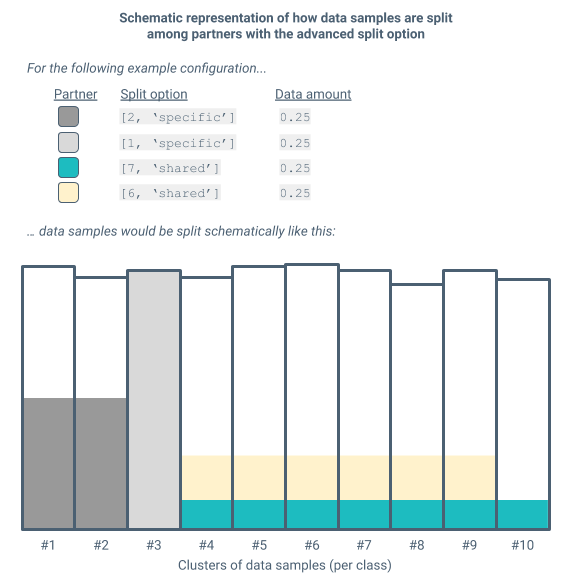
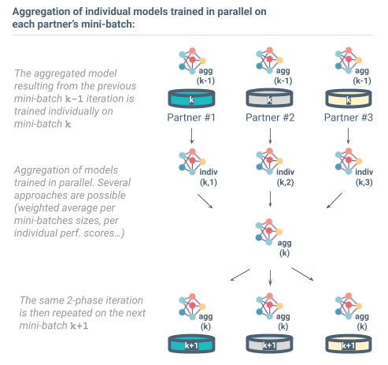
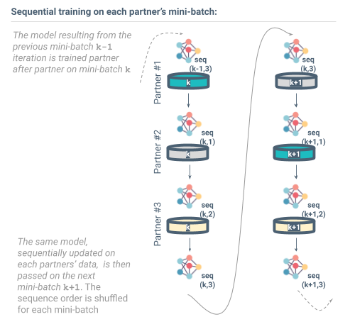
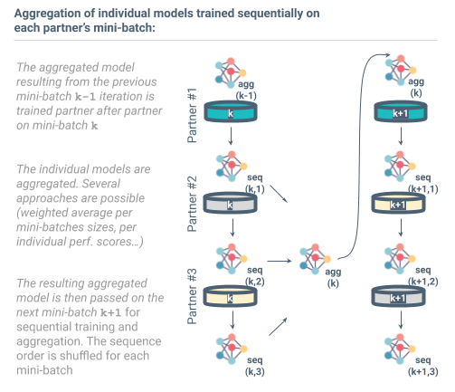

# MPLC - documentation

> *This documentation is work in progress, please don't get mad if you don't find what you are looking for! Drop us a line, we'll do our best to answer you quickly and enhance the documentation.*

Table of content:

- [Pre-requisites](#pre-requisites)
- [Quick start](#quick-start)
  - [My first scenario](#my-first-scenario)
  - [Select a pre-implemented dataset](#select-a-pre-implemented-dataset)
  - [Set some ML parameters](#set-some-ml-parameters)
  - [Run it](#run-it)
  - [Results](#Browsing-results)
  - [Contributivity measurement methods](#contributivity-measurement-methods)
- [Scenario parameters](#scenario-parameters)
  - [Choice of dataset](#choice-of-dataset)
  - [Definition of collaborative scenarios](#definition-of-collaborative-scenarios)
  - [Configuration of the collaborative and distributed learning](#configuration-of-the-collaborative-and-distributed-learning)
  - [Configuration of contributivity measurement methods to be tested](#configuration-of-contributivity-measurement-methods-to-be-tested)
  - [Miscellaneous](#miscellaneous)
- [Experiments](#Experiments)
- [Dataset generation](#dataset-generation)
  - [Dataset](#dataset)
  - [Model generator](#model-generator)
  - [Preprocessing](#data-labels)
  - [Split in train, validation and test sets](#split-in-train-validation-and-test-sets)
- [Contacts, contributions, collaborations](#Contacts,-contributions,-collaborations)

## Pre-requisites

First you need to install mplc. All the dependencies will be installed automatically.

```sh
pip install mplc
```

This installs the last packaged version on PyPI.

If you want to install `mplc` from the repository:

- first make sure that you got the latest version of `pip`.
- then clone the repository, and trigger the installation using `pip`:

```sh
git clone https://github.com/SubstraFoundation/distributed-learning-contributivity.git
cd distributed-learning-contributivity
pip install -e . 
```

## Quick start

First a few words of context! This library enables to run a multi-partner learning and contributivity measurement experiment. This breaks down into three relatively independent blocks:

1. Creating a mock collaborative multi-partner learning scenario
1. Running a multi-partner ML algorithm to learn a model on all partners respective
1. Running one or several contributivity measurement methods to evaluate the performance contribution of each partner's dataset to the model performance.

### My first scenario

To run a multi-partner learning and contributivity measurement experiment, you have to define the scenario for your experiment. For that you'll use the `Scenario` object, in which you will define:

- what dataset will be used and how it will be partitioned among the partners
- what multi-partner learning approach will be used, with what options
- what contributivity measurement approach(es) will be run

There are only 2 mandatory parameters to define a scenario: `partners_count` and `amounts_per_partner`. Many more exist but are optional as default values are configured. You can browse them all in below section [Scenario parameters](#scenario-parameters).

For this very first example scenario, you might want to see what is happening with say 3 partners, where the first one gets 20% of the total dataset, the second one 50% and the third one 30% (for a total of 100%!):

```python
from mplc.scenario import Scenario

my_scenario = Scenario(partners_count=3,
                       amounts_per_partner=[0.2, 0.3, 0.5])
```

> Note: you can use more advanced partitioning options in order to finetune the data distribution between partners to your likings.

At this point, you can already launch your first scenario! But before hitting the `run()` button, let's go just a bit further.

### Select a pre-implemented dataset

You might also want to consider other parameters such as the dataset to be used, for instance. The easiest way to select a dataset is to use those which are already implemented in `mplc`.
Currently MNIST, CIFAR10, TITANIC, IMDB and ESC50 are supported. You can use one of those by simply passing a string identifier to the parameter `dataset` of your scenario object:

```python
from mplc.scenario import Scenario
my_scenario = Scenario(partners_count=3,
                       amounts_per_partner=[0.2, 0.3, 0.5],
                       dataset='mnist')
```

With each dataset, a model architecture is provided by default, so you do not need to care of it. Moreover, the split between the validation and train sets is done by the constructor's of the dataset.
If you want to use a homemade dataset or a homemade model, you will have to use the [dataset class](#dataset-generation).

> Note: this parameter is not mandatory as the MNIST dataset is selected by default.

### Set some ML parameters

Even if default values are provided for iterations parameters, it is strongly advised to adapt these to your particular use case.
For instance, you might want your training to go for `10` epochs and `3` mini-batches per epoch.

```python
from mplc.scenario import Scenario
my_scenario = Scenario(partners_count=3,
                       amounts_per_partner=[0.2, 0.3, 0.5],
                       dataset_name='mnist',
                       epoch_count=10,
                       minibatch_count=3)
```

### Run it

When your scenario is configured and ready, you can then "run" it, meaning execute the multi-partner learning approaches and the contributivity measurement methods you configured:

```python
my_scenario.run()
```

### Browsing results

After a run, every information regarding the training and testing will be available. Under the hood, the training is performed by a `MultiPartnerLearning` object, which is referred to by the `my_scenario.mpl` attribute.
Each `MultiPartnerLearning` object holds a `History` object, which stores all the information related to training and testing.

```python
history = my_scenario.mpl.history 
```

The main attribute of the `history` object is an `history` dictionary, which is structured as followed:

```python
history.history = { 1: {'val_accuracy' : matrix[epoch, minibatch]
                    .   'val_loss'     : matrix[epoch, minibatch]
                    .   'accuracy'     : matrix[epoch, minibatch]
                    .   'loss'         : matrix[epoch, minibatch] }
                    n: { ... }
          'mpl_model':{ 'val_accuracy' : matrix[epoch, minibatch]
                        'val_loss'     : matrix[epoch, minibatch] }
                   } 
```

The n first keys correspond to the partner id, and the data referenced by the `'mpl_model'` key are those of the global model.
As this dictionary is not really user-friendly, you can convert it to a Pandas DataFrame, and use the pandas API to performed advanced analysis easily.
Here is an instance:

```python
history_df = my_scenario.mpl.history.partners_to_dataframe()
losses_per_partners = history_df[history_df.Minibatch==2].pivot(index='Epoch', columns='Partner', values='val_loss')
```

Check out [Tutorial 1](https://github.com/SubstraFoundation/distributed-learning-contributivity/blob/master/notebooks/tutorials/Tutorial-1_Run_your_first_scenario.ipynb) for more instances.

There is few other `History` attributes:

```python
history.save_folder     # Path to the folder where is saved plots
history.nb_epochs_done  # Number of epoch done in the multi_partner_learning, taking into account any early stopping
history.score           # Final score evaluated on the test dataset at the end of the training
history.metrics         # Metrics computed on the partners' models
```

Check out section 4 of [Tutorial 1](https://github.com/SubstraFoundation/distributed-learning-contributivity/blob/master/notebooks/tutorials/Tutorial-1_Run_your_first_scenario.ipynb) for examples.

### Contributivity measurement methods

To configure one or several contributivity measurement methods to be executed, you will have to add them to your `Scenario` object with the `methods` parameter:

```python
from mplc.scenario import Scenario
my_scenario = Scenario(partners_count=3,
                       amounts_per_partner=[0.2, 0.3, 0.5],
                       dataset_name='mnist',
                       epoch_count=10,
                       minibatch_count=3,
                       contributivity_methods=['Shapley values'])
```

Once ran, accessing the results is straightforward:

```python
contributivity_score = my_scenario.contributivity_list
print(contributivity_score[0])
```

> Note: there is a lot more parameters to play with, which are fully explained below.

## Scenario parameters

In this documentation, available scenario parameters are structured into the following subsections:

- [Choice of dataset](#choice-of-dataset)
- [Definition of collaborative scenarios](#definition-of-collaborative-scenarios)
- [Configuration of the collaborative and distributed learning](#configuration-of-the-collaborative-and-distributed-learning)
- [Configuration of contributivity measurement methods to be tested](#configuration-of-contributivity-measurement-methods-to-be-tested)
- [Miscellaneous](#miscellaneous)

### Choice of dataset

There are 2 ways to select a dataset. You can either choose a pre-implemented dataset, by setting the `dataset_name` parameter, or create a custom dataset object and pass it to the `dataset` parameter. To look at the structure of the dataset object, see the [Dataset generation](#dataset-generation) section below.

- `dataset`: `None` (default), `datasets.Dataset object`  
  This enables to use your own dataset, with the class Dataset. The [Tutorial 2](https://github.com/SubstraFoundation/distributed-learning-contributivity/blob/master/notebooks/tutorials/Tutorial-3_Use_homemade_dataset.ipynb) provides more explicit information.
  If None, the dataset provided by the `dataset_name` parameter will be used.  
  Note about validation and test datasets:

  - The `load_data()` method must provide separated train and test sets (referred to as global train set and global test set).
  - The global train set is then further automatically split into a global train set and a global validation set.
  - In the multi-partner learning computations, the global validation set is used for early stopping and the global test set is used for performance evaluation.
  - The global train set is split amongst partner (according to the scenario configuration) to populate the partner's local datasets.
  - For each partner, the local dataset can be split into separate train, validation and test sets, depending on the dataset configuration, by dedicated split method in the dataset subclass.  
    > Note: currently, the local validation and test set are not used, but they are available for further developments of multi-partner learning and contributivity measurement approaches.

- `dataset_name`: `'mnist'` (default), `'cifar10'`, `'esc50'`, `'imdb'` or `'titanic'`  
  MNIST, CIFAR10, ESC50, IMDB and Titanic are currently supported. They come as subclass of the `Dataset` object (`./mplc/dataset.py`), with their corresponding methods for loading data, pre-processing inputs, define a model architecture, etc.
  
  > Note: the pre-implemented example based on the Titanic dataset uses a SKLearn `LogisticRegression()`. PLease note that it requires a dataset partitioning where each partner gets samples from both classes (otherwise you'll get: `ValueError: This solver needs samples of at least 2 classes in the data, but the data contains only one class`).
  
- `init_model_from`: `'random_initialization'` (default) or `'path/to/weights'`  
  For each dataset, it is possible to provide a path to pre-existing model weights. Use `'random_initialization'` (or an empty value) if you want a random initialization of the model.  
  Example: `init_model_from='./my_previously_trained_models/weights_super_model.h5'`

- `dataset_proportion`: `float` (default: `1`).  
  This argument allows you to make computation on a sub-dataset of the provided dataset.
  This is the proportion of the dataset (initially the train and test sets) which is randomly selected to create a sub-dataset,
  it's done before the creation of the global validation set.
  You have to ensure that `0 < dataset_proportion <= 1`.  
  Example: `dataset_proportion=0.2`

### Definition of collaborative scenarios

- `partners_count`: `int`  
  Number of partners in the mocked collaborative ML scenario.  
  Example: `partners_count=4`

- `amounts_per_partner`: `[float]`  
  Fractions of the original dataset each partner receives to mock a collaborative ML scenario where each partner provides data for the ML training.  
  You have to ensure the fractions sum up to `1`.
  Example: `amounts_per_partner=[0.3, 0.3, 0.1, 0.3]`

<a id="sample_split_option"></a>
- `samples_split_option`: Used to set the strategy of samples data split. You can either instantiate a `Splitter` before passing it to `Scenario`, or you can pass it by its string identifier. In the latter case, the default parameters for the `Splitter` selected will be used.
  How the original dataset data samples are split among partners:
  
    - `RandomSplitter`: the dataset is shuffled and partners receive data samples selected randomly. String identifier: `'random'`
      
    - `StratifiedSplitter`: the dataset is stratified per class and each partner receives certain classes only (note: depending on the `amounts_per_partner` specified, there might be some overlap of classes). String identifier: `'stratified'`
    
    - `AdvancedSplitter`: in certain cases it might be interesting to split the dataset among partners in a more elaborate way. For that we consider the data samples from the initial dataset as split in clusters per data labels. The advanced split is configured by indicating, for each partner in sequence, the following 2 elements: `[[nb of clusters (int), 'shared' or 'specific']]`. Practically, you can either instantiate your `AdvancedSplitter` object, and pass this list `[[nb of clusters (int), 'shared' or 'specific']]` to the keyword argument `description`, or use the string identifier and pass the list `[[nb of clusters (int), 'shared' or 'specific']]` to the `Scenario` via the keyword argument `samples_split_configuration`. String identifier:`'advanced'`. Configuration:  
        - `nb of clusters (int)`: the given partner will receive data samples from that many different clusters (clusters of data samples per labels/classes)
        - `'shared'` or `'specific'`:
          - `'shared'`: all partners with option `'shared'` receive data samples picked
                       from clusters they all share data samples from
          - `'specific'`: each partner with option `'specific'` receives data samples picked 
                         from cluster(s) it is the only one to receive from  
    Example: `samples_split_option='advanced', samples_split_configuration=[[7, 'shared'], [6, 'shared'], [2, 'specific'], [1, 'specific']]`
    
    - `FlexibleSplitter`: in other cases one might want to specify in detail the split among partners (partner per partner and class per class). For that the `FlexibleSplitter` can be used. It is configured by indicating, for each partner in sequence, a list of the percentage of samples for each class: `[[% for class 1, ..., % for class n]]`. As above, it can be instantiated separately and then passed to the `Scenario` instance. Or the string identifier `'flexible'` can be used for the parameter `samples_split_option`, coupled with the split configuration passed to the keyword argument `samples_split_configuration`. String identified: `'flexible'`. 
    Example: `samples_split_option='flexible', samples_split_configuration=[[0.0, 0.0, 0.0, 0.0, 0.0, 0.0, 0.0, 0.5, 0.5, 0.5], [0.5, 0.5, 0.5, 1.0, 1.0, 1.0, 0.5, 0.5, 0.5, 0.0]]` (this corresponds to 50% of the last 3 classes for partner 1, and 50% or 100% of each of the first 9 classes for partner 2).  
    Note: in the list of % for each class, one shouldn't interpret the order of its inputs as any human-readable order of the samples (e.g. alphabetical, numerical...). The implementation uses the order in which the samples appear in the dataset. As such, note that one can artificially enforce a certain order if desired, by sorting the dataset beforehand. 



- `corruption_parameters`: `[Corruption(parameters),'permutation']`  Enables to artificially corrupt the data of one or several partners. You can either instantiate a corruption before passing it to Scenario, as in the below example, or you can pass it by its string identifier. In the latter case, the default parameters for the corruption selected will be used. Each partner must be provided a corruption method, so the list of corruption-parameters' size must be equal to the number of partner. All the Corruptions class are defined in the `mplc.corruption module`, and are listed below:

  - `NoCorruption` (default): the data remains unchanged.
    - String id: `'not_corrupted'`
  - `Permutation`. The labels are permuted. Permutation matrix (randomly generated), is available as `.corruption.matrix` attribute of `Partner`.
    - String id: `'permutation'`
  - `PermutationCircular`: The labels are permuted. The circular permutation is used.
    - String id: `'permutation-circular'`
  - `Randomize`: The labels are flipped randomly, according to Dirichlet distribution, which is available as `.corruption.matrix` attribute of `Partner`.
    - String id: `'random'`
  - `RandomizeUniform`: The labels are flipped randomly, according to uniform distribution.
    - String id: `'random-uniform'`
  - `Duplication`: The data are replaced by the data of another partner.
    - Extra-parameter: `'duplicated_partner_id'`: `Partner.id` used by the duplicate corruption method. If not provided, a random partner amongst those with enough data will be selected
    - String id: `'duplication'`
  - `Redundancy`: The data are replaced by a copy of a unique data.
    - String id: `'redundancy'`
      
All of these can use the parameter `'proportion'`: 1. (default), float between 0. and 1. Indicating the proportion of partner's data to corrupt

Example with 4 partners:

```python
from mplc.corruption import Duplication, Permutation
from mplc.scenario import Scenario
partner2_corr = Permutation(proportion=0.3)
partner3_corr = Duplication(duplicated_partner_id=1) #  proportion is equal to 1 by default
my_scenario = Scenario(4, amounts_per_partner=[0.2, 0.3,0.2,0.3],
                       corruption_parameters=['not-corrupted', 'random', partner2_corr, partner3_corr])
```  

### Configuration of the collaborative and distributed learning

There are several parameters influencing how the collaborative and distributed learning is done over the datasets of the partners. The following schema introduces certain definitions used in the below description of parameters:


- `multi_partner_learning_approach`: `'fedavg'` (default), `'seq-pure'`, `'seq-with-final-agg'` or `'seqavg'`  
  Define the multi-partner learning approach, among the following as described by the schemas:

  - `'fedavg'`: stands for federated averaging

    
    
  - `'fedgrads'`: stands for gradient averaging, quite similar to federated averaging, but the partner-loss's gradients are averaged before the optimization step, instead of averaged the model's weights after the optimization step.
  Warning : This method needs a Keras model to work with. The `gradient_pass_per_update` is set to 1 in the current implementation. 
 
  - `'seq-...'`: stands for sequential and comes with 2 variations, `'seq-pure'` with no aggregation at all, and `'seq-with-final-agg'` where an aggregation is performed before evaluating on the validation set and test set (on last mini-batch of each epoch) for mitigating impact when the very last subset on which the model is trained is of low quality, or corrupted, or just detrimental to the model performance.

    

  - `'seqavg'`: stands for sequential averaging

    

  Example: `multi_partner_learning_approach='seqavg'`

- `aggregation_weighting`: `'uniform'` (default), `'data_volume'` or `'local_score'`  
  After a training iteration over a given mini-batch, how individual models of each partner are aggregated:

  - `'uniform'`: simple average (non-weighted)
  - `'data_volume'`: average weighted with per the amounts of data of partners (number of data samples)
  - `'local_score'`: average weighted with the performance (on a central validation set) of the individual models

  Example: `aggregation_weighting='data_volume'`

- `epoch_count`: `int` (default: `40`)  
  Number of epochs, i.e. of passes over the entire datasets. Superseded when `is_early_stopping` is set to `true`.  
  Example: `epoch_count=30`

- `minibatch_count`: `int` (default: `20`)  
  Within an epoch, the learning on each partner's dataset is not done in one single pass. The partners' datasets are split into multiple *mini-batches*, over which learning iterations are performed. These iterations are repeated for all *mini-batches* into which the partner's datasets are split at the beginning of each epoch. This gives a total of `epoch_count * minibatch_count` learning iterations.  
  Example: `minibatch_count=20`

- `gradient_updates_per_pass_count`: `int` (default: `8`)  
  The ML training implemented relies on Keras' `.fit()` function, which takes as argument a `batch_size` interpreted by `fit()` as the number of samples per gradient update. Depending on the number of samples in the train dataset, this defines how many gradient updates are done by `.fit()`. The `gradient_updates_per_pass_count` parameter enables to specify this number of gradient updates per `.fit()` iteration (both in multi-partner setting where there is 1 `.fit()` iteration per mini-batch, and in single-partner setting where there is 1 `.fit()` iteration per epoch).  
  Example: `gradient_updates_per_pass_count=5`

- `is_early_stopping`: `True` (default) or `False`  
  When set to `True`, the training phases (whether multi-partner of single-partner) are stopped when the performance on the validation set reaches a plateau.  
  Example: `is_early_stopping=False`

> Note: to only run the distributed learning approaches (and no contributivity measurement methods), simply omit the `methods` parameter (see section [Configuration of contributivity measurement methods to be tested](#configuration-of-contributivity-measurement-methods-to-be-tested) below).

### Configuration of contributivity measurement methods to be tested

- `methods`:  
  A declarative list `[]` of the contributivity measurement methods to be executed.
  All methods available are:

  ```sh
  - "Shapley values"
  - "Independent scores"
  - "TMCS"
  - "ITMCS"
  - "IS_lin_S"
  - "IS_reg_S"
  - "AIS_Kriging_S"
  - "SMCS"
  - "WR_SMC"
  - "Federated SBS linear"
  - "Federated SBS quadratic"
  - "Federated SBS constant"
  - "Smodel"
  - "PVRL"
  ```

The methods are detailed below:

- **Independent training**:

  - `["Independent scores"]` **Performance scores** of models trained independently on each partner

- [**Shapley values**](https://arxiv.org/pdf/1902.10275.pdf):  

  These indicators seem to be very good candidates to measure the contributivity of each data providers, because they are usually used in game theory to fairly attributes the gain of a coalition game amongst its players, which is exactly what we are looking for here.

  A coalition game is a game where players form coalitions and each coalitions gets a score according to some rules. The winners are the players who manage to be in the coalition with the best score. Here we can consider each data provider is a player, and that forming a coalition is building a federated model using the dataset of each player within the coalition. The score of a coalition is then the performance on a test set of the federated model built by the coalition.

  To attributes a part of the global score to each player/data providers, we can use the Shapley values. To define the Shapley value we first have to define the "increment" in performance of a player in a coalition. Such "increment" is the performance of the coalition minus the performance of the coalition without this player. The Shapley value of a player is a properly weighted average of its "increments" in every possible coalition.

  The computation of the Shapley Values quickly becomes intensive when the number of players increases. Indeed to compute the increment of a coalition, we need to fit two federated model, and we need to do this for every possible coalitions. If *N* is the number of players we have to do *2^N* fits to compute the Shapley values of each players. As this is quickly too costly, we are considering estimating the Shapley values rather then computing it exactly. The estimation methods considered are:

  - `["Shapley values"]` **The exact Shapley Values computation**:  
    Given the limited number of data partners we consider at that stage it is possible to actually compute the Shapley Values with a reasonable amount of resources.

  - **[Monte-Carlo Shapley](https://arxiv.org/pdf/1902.10275.pdf) approximation** (also called permutation sampling):  
  As the Shapley value is an average we can estimate it using the Monte-Carlo method. Here it consists in sampling a reasonable number of increments (says a hundred per player) and to take the average of the sampled increments of a player as the estimation of the Shapley value of that player.

  - `["TMCS"]` **[Truncated Monte-Carlo Shapley](https://arxiv.org/pdf/1904.02868.pdf) approximation**:  
  The idea of Truncated Monte-Carlo is that, for a large coalition, the increments of a player are usually small, therefore we can consider their value is null instead of spending computational power to compute it. This reduce the number of times we have to fit a model, but adds a small bias in the estimation.

  - `["ITMCS"]` **Interpolated Truncated Monte-Carlo Shapley**:  

  This method is an attempt to reduce the bias of the Truncated Monte-Carlo Shapley method. Here we do not consider that the value of an increment of a large coalition is null, but we do a linear interpolation to better approximate its value.

- **Importance sampling methods**:

  Importance sampling is a method to reduce the number of sampled increments in the Monte-Carlo method while keeping the same accuracy. It consists in sampling the increments according to non-uniform distribution, giving more chance for big increment than for small increment to be sampled. The bias induced by altering the sampling distribution is canceled by properly weighting each sample: if an increment is sampled with *X* times more chances, then we weight it by *1/X*. Note that this require to know the value of increment before computing them, so in practice we try to guess the value of the increment. We inflate, resp. deflate, the probability of sampling an increment if we guess that its value is high, resp. small. We designed three ways to guess the value of increments, which lead to three different importance sampling methods:

  - `["IS_lin_S"]` **Linear importance sampling**
  - `["IS_reg_S"]` **Regression importance sampling**
  - `["AIS_Kriging_S"]` **Adaptive Kriging importance sampling**

- **[Stratified Monte Carlo Shapley](https://arxiv.org/pdf/1904.02868.pdf)**:

  "Stratification and with proper allocation" is another method to reduce the number of sampled increments in the Monte-Carlo method while keeping the same accuracy. There are two ideas behind this method:

  1. The Shapley value is a mean of means taken on strata of increments. A strata of increments corresponds to all the increments of coalitions with the same number of players. We can estimate the means on each strata independently rather than the whole mean, this improves the accuracy and reduces the number of increments to sample.
  1. We can allocate a different amount of sampled increment to each mean of a strata. If we allocate more sample to the stratas where the increments value varies more, we can reduce the accuracy even more.

  As we can estimate the mean of a strata by sampling with replacement of without replacement, it gives two approximation methods:

  - `["SMCS"]` **Stratified Monte Carlo Shapley with replacement**
  - `["WR_SMC"]` **Stratified Monte Carlo Shapley without replacement**

- **Partner Valuation by Reinforcement Learning**:

    With PVRL, we modify the learning process of the main model so it includes a dataset's partner valuation part. Namely we assign weight to each dataset, and at each learning step these weights are used to sample the learning batch. These weight are updated at each learning iteration of the main model using the REINFORCE method.

  - `["PVRL"]` **Partner Valuation by Reinforcement Learning**

- **Federated step-by-step**:

  Federated step by step contributivity methods measure the performance variation on the global validation dataset after each minibatch training - These methods give an estimation on how the model improved on every node.
  The methods are best suited for federated averaging learning.
  For each computation round, the contributivity for each partner is calculated as the ratio between the validation score of the newly trained model for each partner and the validation score from the previously trained collective model.
  Initial rounds (10%) and final rounds (10%) are discarded from calculation as performance increments from the first minibatches might be huge and increments form the last minibatches might be very noisy. Discarded proportions are for now set in the code.

    3 contributivity methods are proposed to adjust the importance of last computation rounds compared to the first ones:
    
    - `["Federated SBS linear"]` - Linear importance increase between computation rounds (1000th round weights 1000 times first round)
    - `["Federated SBS quadratic"]` - Quadratic importance increase between computation rounds (1000th round weights 10e6 times first round)
    - `["Federated SBS constant"]`- Constant importance increase between computation rounds (1000th round weights same as first round)
    
- **Detection of mislabelled datasets**
    
    The S-model method provides a way to detect mislabelled datasets.
    In this method, we assume the label provided in the partner dataset are possibly noisy labels. The model is trained by maximizing the likelihood of these noisy data. This requires to learn, while training the model, the probability that a label have been flipped in another, inside each partner dataset.  
    A contributivity measure can be inferred from partner's matrices of flip-probability, by computing the exponential inverse of the Frobenius distance to the identity. 
    However this measure is to be handle carefully, the method is not designed specifically for contributivity measurement, but for mislabelled dataset detection. 
    
    - `["S-Model"]` - Learning method robust to noisy label in the datasets

> Note: when `methods` is omitted in the config file only the distributed learning is run.

Example: `methods=["Shapley values", "Independent scores", "TMCS"]`

### Miscellaneous

- `is_quick_demo`: `True` or `False` (default)  
  When set to `True`, the amount of data samples and the number of epochs and mini-batches are significantly reduced, to minimize the duration of the run. This is particularly useful for quick demos or simply for debugging.  
  Example: `is_quick_demo=True`
  
- `val_set`: `'local'` or `'global'`. If set to global, the validation set used is the one of the dataset. If local, the global validation set is splitted between partners, according to the samples split option. The validation data are also corrupted according to the partner-corruption's configuration.

- `test_set`: `'local'` or `'global'`.Same as `val_set` but for test dataset. 
  
## Experiments

At some point of your use of the library you might need to launch several scenarios in a row. It the same spirit, you might want to repeat one scenario's run, to get rid of the randomness of training, and end with more meaningful results.

The `Experiment` object allows you to set a list of scenarios to run, along with a wanted number of repetition. Once instancied, scenarios can be added via the `.add_scenario()`. Eventually, all the scenarios can be run, and repeated, by calling the `.run()` method.

### Experiment's parameters

Few parameters can be set:

- `experiment_name`: String, default `'experiment'`. Name of the experiment, will be used for the save path. The full experiment name will be followed by creation date/time, and by a hash if the experiment name already exists.
- `nb_repeats`: int, Number of repetition for the experiment, in which each scenario will be run
- `scenario_list`: list of scenarios to be run during the experiment. Scenario can also be added via the `.add_scenario()` method
- `is_save`: boolean. If set to True, the experiment will be save on disk.

### Save folder

Another parameter can be passed via the kwargs: `experiment_path`, string which will be used to define the path where the save folder will be created. The default path is set in the `mplc.constant` module, at `EXPERIMENTS_FOLDER_NAME`. The save path follows this pattern: `experiment_path` / `experiment_name`. Save folder architecture:

```sh
experiment_name
        ├── scenario_0_repeat_0_...                         <- Folder result of the first scenario, first repeat
        ├── scenario_0_repeat_1_...                         <- Folder result of the first scenario, second repeat
        .       ├── graphs                                  <- default graphs for the scenario
        .       |     ├── all_partners_val_acc.png          <- Accuracy of intermediate models per partners
        .       |     ├── data_distribution.png             <- Data distribution amounst the partner
        .       |     ├── federated_training_val_acc.png    <- Validation loss for the mpl model
        .       |     └── federated_training_val_loss.png   <- Validation accuracy for the mpl model
        .       └── main_mpl                                <- Folder with main mpl result
        .             ├── model                             <- Store the final model weights (numpy format)
        .             └── history.csv                       <- Store all the metrics computed during the training
        ├── scenario_k_repeat_n_...                         <- Folder result of the last scenario, last repetition
        ├── debug.log                                       <- Record of the log output, debug level
        ├── info.log                                        <- Record of the log output, info level
        └── result.csv                                      <- Result of all the scenarios, all repeats. 
```

### Example

````python
from mplc.experiment import Experiment
from mplc.scenario import Scenario

scenario0 = Scenario(4, [0.25]*4)
scenario1 = Scenario(10, [0.1]*10)
scenario2 = Scenario(4, [0.8, 0.1, 0.05, 0.05])

exp = Experiment(experiment_name='my_experiment', nb_repeats=10, scenarios_list=[scenario0, scenario1])
exp.add_scenario(scenario2)

exp.run()
````

## Dataset generation

The `Dataset` object is useful if you want to define custom datasets and related objects such as preprocessing functions and model generator. It is demonstrated in [Tutorial 3 - Use homemade dataset](https://github.com/SubstraFoundation/distributed-learning-contributivity/blob/master/notebooks/tutorials/Tutorial-3_Use_homemade_dataset.ipynb).

### Dataset

The `Dataset` abstract class implements most of the methods needed by the library. To use a custom dataset, you must define a new class, which inherit from the `Dataset` one
Don't forget to call the `Dataset.__init__()` via the super function. It will require some parameters. 
Here is the structure of the `Dataset` generator:

```python
from mplc.dataset import Dataset
class MyDataset(Dataset):
    def __init__(self):
        #  load and preprocess the train and test data. 
        super().__init__('dataset_name',
                         input_shape,
                         num_classes,
                         x_train,
                         y_train,
                         x_test,
                         y_test)
   
    def generate_new_model(self):
        # Initialize a model 
        return model 
     
```

### Model generator

The method `generate_new_model()` needs to be implemented and provide the model to be trained.

> Note: it is mandatory to have loss and accuracy as metrics for your model.

Currently the library handles compiled Keras' models (see MNIST, ESC50, IMDB and CIFAR10 datasets). Scikit-Learn Logistic Regression models can be adapted to work with the library (see the TITANIC dataset).

### Data labels

The data labels can take whatever shape you need, with only one condition. The labels need to be convertible into string format, and with respect to the condition that if `label1` is equal to `label2` (reciprocally different from), therefore `str(label1)` must be equal to `str(label2)` (reciprocally different from).

### Split in train, validation and test sets

The `Dataset` object must provide separate train and test sets (referred to as global train set and global test set).

The global train set is then further split into a global train set and a global validation set, in a stratified way. Please note that you can specified the proportion of the train set used for validation via the `val_proportion` keyword argument. Default is `0.10`.

In the multi-partner learning computations, the validation set is used for early stopping and the test set is used for performance evaluation.

## Run the tests

You will first need to install the dev dependencies with `pip3 install -r dev-requirements.txt` and then run:

```sh
# Run unit tests
pytest -vv tests/unit_tests.py
# or 
python3 -m pytest -vv tests/unit_tests.py

# Fall in debugger breakpoint in case of error
pytest -vv tests/unit_tests.py --pdb

# Run tests and produce a coverage measure. This will output a .coverage file
pytest -vv --cov=mplc tests/unit_tests.py
```

## Contacts, contributions, collaborations

Should you be interested in this open effort and would like to share any question, suggestion or input, you can use the following channels:

- This Github repository (issues or PRs)
- Substra Foundation's Slack workspace, channel #workgroup-mpl-contributivity
- Email: <hello@substra.org>


